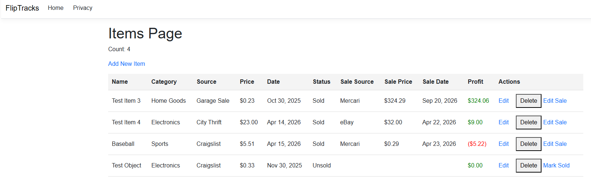
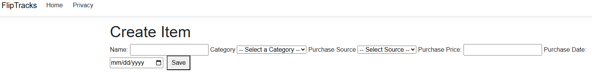
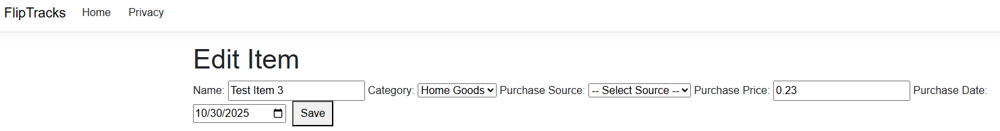
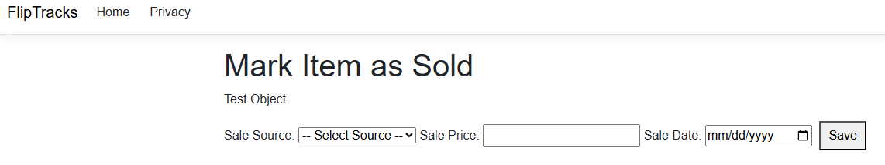

# FlipTracks

FlipTracks is a full-stack ASP.NET Core MVC application for tracking purchased items, recording sales, and calculating profit.

It was built to simulate a real-world flipping/resale workflow where items are bought, sold, and analyzed for profitability.

---

## Features

### Inventory Management
- Add items with:
  - Name
  - Category (dropdown)
  - Purchase Source (with “Other” option)
  - Purchase Price
  - Purchase Date

### Sales Tracking
- Mark items as sold
- Record:
  - Sale Source (with “Other” option)
  - Sale Price
  - Sale Date

### Profit Calculation
- Automatically calculates profit:
- Profit = Sale Price - Purchase Price
- Visual feedback:
- Green for profit
- Red for loss

### Editing
- Edit item details after creation
- Edit sale information after marking as sold

### State-Based UI
- Unsold items show:
- “Mark Sold”
- Sold items show:
- “Edit Sale”

### Data Safety
- Delete confirmation prevents accidental removal
- Null-safe handling of optional fields

### Clean UI
- Table-based layout for readability
- Currency and date formatting
- Empty state when no items exist

---

## Tech Stack

- **Backend:** ASP.NET Core MVC (.NET)
- **Language:** C#
- **Database:** SQLite
- **ORM:** Entity Framework Core
- **Frontend:** Razor Views + HTML/CSS + minimal JavaScript

---

## Key Concepts Demonstrated

- MVC Architecture (Model / View / Controller)
- Dependency Injection
- Entity Framework (DbContext, DbSet)
- CRUD operations
- Model Binding
- Razor syntax (`@model`, `@if`, inline expressions)
- Conditional UI rendering
- Form handling (GET/POST)
- Data validation patterns
- Separation of concerns

---

## Screenshots

### Items Table

### Create Item

### Edit Item

### Sell Item

- Items Table
- Create Item Form
- Edit Item Page
- Mark as Sold Page

---

## Getting Started

1. Clone the repository: git clone https://github.com/hkbohlken/FlipTracks.git
2. Navigate into the project: cd Fliptracks
3. Run the application: dotnet run
4. Open in browser: http://localhost:xxxx

---

## Future Improvements

- Mark item as unsold (revert sale)
- Filter/search items
- Category management via database
- Dashboard (total profit, stats)
- Authentication (multi-user support)
- API layer for frontend frameworks

---

## About This Project

This project was built to move beyond simple CRUD apps by incorporating:

- real-world business logic (profit calculation)
- dynamic UI behavior based on state
- thoughtful user experience decisions

It represents a transition from learning syntax to building functional, user-focused software.

---

## Author

Built by Heather Bohlken
